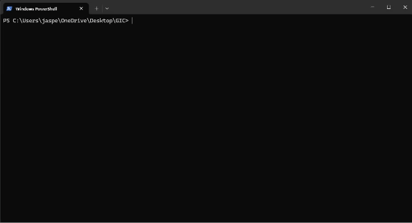

[]

# AwesomeGICBank
# Introduction
Welcome to AwesomeGIC Bank, a small banking simulation designed to simulate deposit, withdrawal and printing of customer statements.

# Background

This project simulates a simple banking system to handle basic operations on bank accounts.  
Currently, this application is developed to deliver these three main features.  
- Depositing into account
- Withdrawing from account
- Printing account statement

# Quick Start

## Using Java
1. Please ensure you have Java 11 and above installed into your system.
2. Open this current directory in your terminal.
3. Enter `java -jar FinalApplicationJar/AwesomeGICBank.jar` into your terminal to run the application.
4. Alternatively, you may type `./gradlew run` into the current directory to run the application. 
5. Another alternative would be to go to the [GitHub releases](https://github.com/Jaspertzx/AwesomeGICBank/releases) to 
download a working jar file.

# Developer Comments

Hello! I have added persistent storage to this banking system as well.
If you would like to start anew, you may enter:
- `rm .\AwesomeGICData\ -Recurse` (Windows Powershell)
- `rmdir AwesomeGICData /s` (Windows Terminal)   
- or simply delete the folder called `AwesomeGICData` in your file explorer

in your terminal, in the same directory where you have executed the Jar file.   
This command will delete the folder created in the directory from which you ran the Jar file, and remove all statements
and the bank balance.

If you have any questions or clarifications, please feel free to contact me at `jaspertzx@gmail.com`

# Features

## Deposit

Deposits a specified amount into the bank account.  
Note: Entering a value of `0` will automatically navigate you back to the main menu. This action is designed this
way because depositing $0.00 does not affect the bank balance.

Example: 
1. `D` or `d`
2. `<specified amount>`

Expected output:
```
Thank you. $<specified amount> has been deposited.
```

## Withdraw
Withdraws a specified amount from the bank account.  
Note: Entering a value of `0` will automatically navigate you back to the main menu. This action is designed this
way because withdrawing $0.00 as nothing is withdrawn.

Example:
1. `W` or `w`
2. `<specified amount>`

Expected output:
```
Thank you. $<specified amount> has been withdrawn.
```

## Print
Prints your current back account statements.  
This includes both deposits and withdrawals.

Example: `P` or `p`

Expected output (sample):
```
Date                   | Amount     | Balance
27 Mar 2024 01:09:04PM | 100.00     | 100.00
27 Mar 2024 01:09:06PM | -50.00     | 50.00
```

## Quit
Closes the application

Example: `Q` or `q`